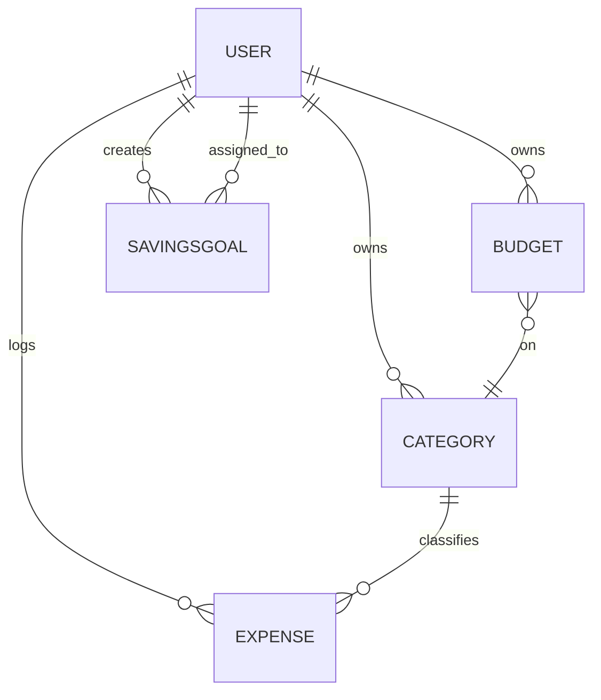

# 🚀 Backend

### config/database.js  
This module initializes the MongoDB connection using Mongoose.  
- Exports a `connectDB` function.  
- Reads `MONGO_URI` from environment variables.  
- Logs connection success or exits on error.  
- Imported and invoked in **server.js**.  

```js
const mongoose = require('mongoose');

const connectDB = async () => {
  try {
    const conn = await mongoose.connect(process.env.MONGO_URI);
    console.log(`MongoDB Connected: ${conn.connection.host}`);
  } catch (error) {
    console.error(`Error: ${error.message}`);
    process.exit(1);
  }
};

module.exports = connectDB;
```

---

### controllers/authController.js  
Handles user authentication, registration, and password resets.  
- **register**: Validates input, creates user, issues JWT.  
- **login**: Verifies credentials, issues JWT.  
- **forgotPassword**: Generates reset token, sends email.  
- **resetPassword**: Verifies token, updates password.  
- Uses **models/User.js** and **utils/sendEmail.js**.  

---

### controllers/budgetController.js  
Manages budget CRUD and alerts.  
- **getBudgets**, **getBudget**, **createBudget**, **updateBudget**, **deleteBudget**.  
- **getBudgetAlerts**: Returns budgets that are over or near limit.  
- Aggregates expenses via **models/Expense.js**.  
- Populates each budget’s **category** from **models/Category.js**.  

---

### controllers/categoryController.js  
Handles category management and defaults.  
- **getCategories**, **createCategory**, **updateCategory**, **deleteCategory**.  
- **initializeDefaultCategories**: Seeds default icons and colors.  
- Relies on **models/Category.js**.  

---

### controllers/dashboardController.js  
Aggregates data for user dashboard.  
- **getDashboard**: Income, balance, expense stats, budgets, savings, trends.  
- **getSpendingTrends**: Custom date-range aggregation.  
- **getCategoryComparison**: Month-over-month category spend.  
- Pulls from **models/User.js**, **Expense.js**, **Budget.js**, **SavingsGoal.js**.  

---

### controllers/expenseController.js  
Manages expense CRUD and statistics.  
- **getExpenses**: Filtering, pagination, search.  
- **getExpense**, **createExpense**, **updateExpense**, **deleteExpense**.  
- **getExpenseStats**: Monthly/annual summary.  
- Validates category ownership via **models/Category.js**.  

---

### controllers/savingsController.js  
Manages savings goals and contributions.  
- **getSavingsGoals**, **getSavingsGoal**, **createSavingsGoal**, **updateSavingsGoal**, **deleteSavingsGoal**.  
- **contributeSavings**, **withdrawSavings**: Adjusts goal balances.  
- **getSavingsSummary**: Aggregates goal counts and amounts.  
- Operates on **models/SavingsGoal.js**.  

---

### middleware/auth.js  
Protects routes by verifying JWT tokens.  
- Extracts token from `Authorization` header.  
- Verifies via `jsonwebtoken`.  
- Attaches `req.user` from **models/User.js**.  
- Returns 401 on failure.  

```js
exports.protect = async (req, res, next) => {
  // ...
};
```  

---

### middleware/errorHandler.js  
Centralizes error responses.  
- Logs errors to console.  
- Handles Mongoose `CastError` and duplicate key errors.  
- Sends JSON `{ success: false, message }`.  
- Mounted after all routes in **server.js**.  

---

### models/User.js  
Defines the User schema.  
- Fields: `firstName`, `lastName`, `email`, `password`, `city`, `country`, `currency`, `income`, password reset tokens.  
- **Pre-save hook** to hash passwords.  
- Methods: `matchPassword`, `getSignedJwtToken`, `getResetPasswordToken`.  

---

### models/Category.js  
Defines the Category schema.  
- Fields: `name`, `icon`, `color`, `user` (ref to User), `isDefault`.  
- Enforces unique color/icon combos per user.  

---

### models/Expense.js  
Defines the Expense schema.  
- Fields: `amount`, `description`, `category` (ref to Category), `user` (ref), `date`, `paymentMethod`, `notes`.  

---

### models/Budget.js  
Defines the Budget schema.  
- Fields: `amount`, `period`, `alertThreshold`, `startDate`, `endDate`, `category` (ref), `user` (ref), `isActive`.  

---

### models/SavingsGoal.js  
Defines the SavingsGoal schema.  
- Fields: `name`, `description`, `targetAmount`, `currentAmount`, `targetDate`, `isCompleted`, timestamps, `user` (ref).  

---

### routes/authRoutes.js  
Mounts authentication endpoints.  
- Public:  
  - `POST /api/auth/register`  
  - `POST /api/auth/login`  
  - `POST /api/auth/forgotpassword`  
  - `PUT /api/auth/resetpassword/:resettoken`  
- Protected (via `protect`):  
  - `GET /api/auth/me`  
  - `PUT /api/auth/income`  

---

### routes/categoryRoutes.js  
All routes require authentication.  
- `GET /api/categories`  
- `POST /api/categories`  
- `POST /api/categories/init-defaults`  
- `PUT /api/categories/:id`  
- `DELETE /api/categories/:id`  

---

### routes/expenseRoutes.js  
All routes require authentication.  
- `GET /api/expenses`  
- `POST /api/expenses`  
- `GET /api/expenses/stats/summary`  
- `GET /api/expenses/:id`  
- `PUT /api/expenses/:id`  
- `DELETE /api/expenses/:id`  

---

### routes/budgetRoutes.js  
All routes require authentication.  
- `GET /api/budgets`  
- `POST /api/budgets`  
- `GET /api/budgets/alerts`  
- `GET /api/budgets/:id`  
- `PUT /api/budgets/:id`  
- `DELETE /api/budgets/:id`  

---

### routes/savingsRoutes.js  
All routes require authentication.  
- `GET /api/savings`  
- `POST /api/savings`  
- `GET /api/savings/summary`  
- `GET /api/savings/:id`  
- `PUT /api/savings/:id`  
- `DELETE /api/savings/:id`  
- `POST /api/savings/:id/contribute`  
- `POST /api/savings/:id/withdraw`  

---

### routes/dashboardRoutes.js  
All routes require authentication.  
- `GET /api/dashboard`  
- `GET /api/dashboard/trends`  
- `GET /api/dashboard/category-comparison`  

---

### utils/sendEmail.js  
Wraps Nodemailer to send transactional emails.  
- Reads SMTP config from environment.  
- Exposes `sendEmail({ email, subject, message })`.  

---

### server.js  
Bootstraps the Express app.  
- Loads `.env`, connects DB, sets up JSON parser and CORS.  
- Mounts all routers under `/api/*`.  
- Defines a health check at `/`.  
- Applies error handler last.  
- Listens on `process.env.PORT` or `5000`.  

```bash
npm run dev  # starts nodemon src/server.js
```

---

### package.json  
Lists backend dependencies: `express`, `mongoose`, `jsonwebtoken`, `bcryptjs`, `nodemailer`, etc.  
Defines `start` and `dev` scripts.

---

## 🗄️ Data Model Relationships



---

# 🖥️ Frontend

### public/robots.txt  
Directs crawlers to index the site fully.  

---

## Core Entry Points

### src/main.tsx  
Initializes React root and renders **App.tsx**.  

```ts
createRoot(document.getElementById("root")!).render(<App />);
```

### src/App.tsx  
Configures global providers and routing.  
- **QueryClientProvider** for React Query.  
- **AuthProvider** for auth state.  
- **TooltipProvider**, **Toaster** for UI.  
- Defines routes for public and protected pages.  

---

## Context & Hooks

### src/contexts/AuthContext.tsx  
Manages authentication state.  
- Exposes `login`, `register`, `logout`, `updateIncome`.  
- Persists JWT in `localStorage`.  

### src/hooks/use-mobile.tsx  
Detects screen size to toggle mobile layouts.  

### src/hooks/use-toast.ts  
Custom toast manager with limit and queue logic.  

---

## API & Utilities

### src/lib/api.ts  
Configures Axios instance with:  
- Base URL from `VITE_API_BASE_URL`.  
- JSON headers.  
- Request interceptor to attach bearer token.  
- Response interceptor to redirect on 401.  

### src/lib/utils.ts  
Exports `cn()` to merge Tailwind CSS classes via `clsx` and `twMerge`.  

### src/utils/helpers.js  
Formatting helpers:  
- `formatCurrency`  
- `formatDate`  
- `formatDateForInput`  
- `getRelativeTime`  

---

## UI Primitives (src/components/ui)  
Wrappers around Radix UI and custom styles.  
- accordion.tsx, alert.tsx, alert-dialog.tsx, aspect-ratio.tsx, avatar.tsx, badge.tsx, breadcrumb.tsx, button.tsx, calendar.tsx, card.tsx, carousel.tsx, chart.tsx, checkbox.tsx, collapsible.tsx, command.tsx, context-menu.tsx, dialog.tsx, drawer.tsx, dropdown-menu.tsx, form.tsx, hover-card.tsx, input.tsx, input-otp.tsx, label.tsx, menubar.tsx, navigation-menu.tsx, pagination.tsx, popover.tsx, progress.tsx, radio-group.tsx, resizable.tsx, scroll-area.tsx, select.tsx, separator.tsx, sheet.tsx, sidebar.tsx, skeleton.tsx, slider.tsx, sonner.tsx, switch.tsx, table.tsx, tabs.tsx, textarea.tsx, toast.tsx, toaster.tsx, toggle-group.tsx, toggle.tsx, tooltip.tsx, use-toast.ts.  
Each component ensures consistent theming and accessibility.

---

## Feature Components

- **BudgetDialog.tsx**: Create/update budgets.  
- **ContributeDialog.tsx**: Add funds to savings goals.  
- **DeleteDialog.tsx**: Confirmation for destructive actions.  
- **ExpenseDialog.tsx**: Create/update expenses.  
- **ExpenseList.tsx**: Scrollable list of expenses.  
- **IncomeDialog.tsx**: Update user income.  
- **NavLink.tsx**: Styled navigation links.  
- **ProtectedRoute.tsx**: Guards private routes.  
- **SavingsDialog.tsx**: Create/update savings goals.  
- **DashboardLayout.tsx**: Sidebar + header for authenticated pages.  

---

## Pages (src/pages)

- **Index.tsx**: Landing page with marketing sections.  
- **Login.tsx**: Login form.  
- **Register.tsx**: User signup form.  
- **ForgotPassword.tsx** / **ResetPassword.tsx**: Password recovery flows.  
- **Dashboard.tsx**: Overview with charts, trends, alerts.  
- **Expenses.tsx**: Expense management with filters.  
- **Budgets.tsx**: Budget overview and progress bars.  
- **Savings.tsx**: Savings goals list and contributions.  
- **Categories.tsx**: CRUD for custom categories.  
- **NotFound.tsx**: 404 fallback.  

---

## HTML Template

### index.html  
Root HTML page referencing Vite-built assets and Tailwind CSS.  

---

By following this structure, each layer—data, API, and UI—connects seamlessly:  
- **Models** feed **Controllers**.  
- **Controllers** power **Routes**.  
- **Routes** back the **API** consumed by **lib/api.ts**.  
- **Components** bind to **Pages**, all orchestrated in **App.tsx** under **AuthContext**.
